<div align="center">
  
</div>

<p align="center">
  
</p>

<div align="center">
  
  
  [](https://github.com/dev-bhaveshye)
  [](https://github.com/dev-bhaveshye)
  
</div>

---

## 🎯 **About Me**

```java
public class Bhavesh {
    private String role = "Java Backend Developer";
    private String[] passions = {"Spring Boot", "AI/ML", "System Design"};
    private String currentFocus = "Building scalable microservices";
    private String motto = "Code, Learn, Repeat ☕";
    
    public void dailyRoutine() {
        while(passionate) {
            learn();
            code();
            innovate();
            coffee();
        }
    }
}
```


🔥 **What I'm passionate about:**
- 🏗️ Architecting robust backend systems with **Spring Boot** 
- 🤖 Leveraging **AI/ML** to solve complex real-world problems
- 🧠 Mastering **algorithmic thinking** and **data structures**
- 📚 Currently diving deep into **System Design** & **Advanced Java**
- 🚀 Building projects that make a difference

<br clear="right"/>

---

## 🎨 **Current Status**

<div align="center">
  
🔭 Currently Working On: A live e-commerce platform project during my internship, focusing on backend development using Java and Spring Boot.
  
🌱 Learning:   Advanced System Design, Kafka, Redis

💬 Ask me about:   Java, Spring Boot, AI/ML, Backend Architecture

⚡ Fun fact:   I debug with System.out.println() and I'm proud of it! 😄

</div>

---

## 📊 **GitHub Analytics**

<div align="center">
  
   
  
  
</div>

<div align="center">
  
   <!-- Top Languages -->
 

  <!-- Contribution Graph -->
  
  
</div>

---

## 🛠️ **Tech Arsenal**

<div align="center">

### **Languages & Frameworks**


### **Databases & Cloud**


### **AI/ML & Data Science**


### **Tools & DevOps**


</div>

---

## 🔨 **Currently Working On**

<div align="center">
  
  [](https://github.com/dev-bhaveshye/JOURNAL-PROJECT)
  
</div>

---

## 💡 **Developer Journey**

```mermaid
graph LR
    A[🎓 Computer Science] --> B[☕ Java Basics]
    B --> C[🌱 Spring Framework]
    C --> D[🚀 Spring Boot]
    D --> E[🤖 AI & ML]
    E --> F[🏗️ System Design]
    F --> G[🌟 Full Stack]
    
    style A fill:#ff6b6b
    style B fill:#4ecdc4
    style C fill:#45b7d1
    style D fill:#96ceb4
    style E fill:#ffeaa7
    style F fill:#dda0dd
    style G fill:#98d8c8
```

<div align="center">



</div>

---

## 🎯 **2025 Goals**

<div align="center">
  
- [ ] ☕ Master Spring Boot fundamentals and advanced concepts
- [ ] 🚀 Learn Microservices Architecture patterns
- [ ] 🤖 Build **3 AI-powered applications**
- [ ] 🌟 Contribute to **5 open-source projects**
- [ ] 💼 Land a **Java Developer / SDE** role

</div>

---

## 🎉 **Fun Zone**

<div align="center">
  
  
  
</div>

<details>
<summary>🎯 <b>Random Dev Quote</b></summary>
<br>
<div align="center">
  
</div>
</details>

<details>
<summary>☕ <b>Coffee-Driven Development</b></summary>
<br>

```java
public class CoffeeDrivenDevelopment {
    private int coffeeLevel = 100;
    private boolean isProductive = true;
    
    public void code() {
        while(coffeeLevel > 0) {
            writeCode();
            coffeeLevel -= 10;
            
            if(coffeeLevel < 30) {
                makeCoffee();
                coffeeLevel = 100;
                isProductive = true;
            }
        }
    }
    
    private void writeCode() {
        System.out.println("Writing awesome Java code! ☕");
    }
    
    private void makeCoffee() {
        System.out.println("Time for a coffee break! ☕");
    }
}
```

</details>

---

## 🌐 **Connect & Collaborate**

<div align="center">
  
  <a href="https://www.linkedin.com/in/bhavesh-yelekar-907722251/">
    
  </a>
  <a href="mailto:dev.bhavesh@example.com">
    
  </a>
  <a href="https://t.me/Bhaveshye">
    
  </a>
  <a href="https://instagram.com/bhavesh_ye">
    
  </a>
  <a href="https://github.com/dev-bhaveshye">
    
  </a>
  
</div>

---

<div align="center">
  
  **💙 If you like what I do, consider giving my repos a star!**
  
  
  
</div>

<div align="center">
  
</div>

<div align="center">
  
  <!-- Optional: Add this once you set up the snake animation GitHub Action -->
  <!--  -->
  
</div>
